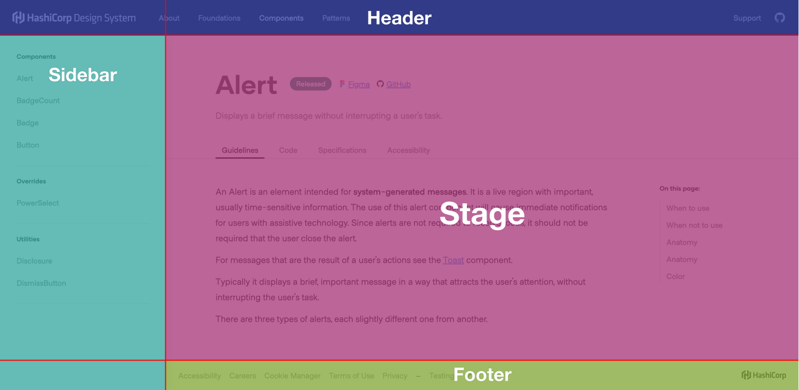
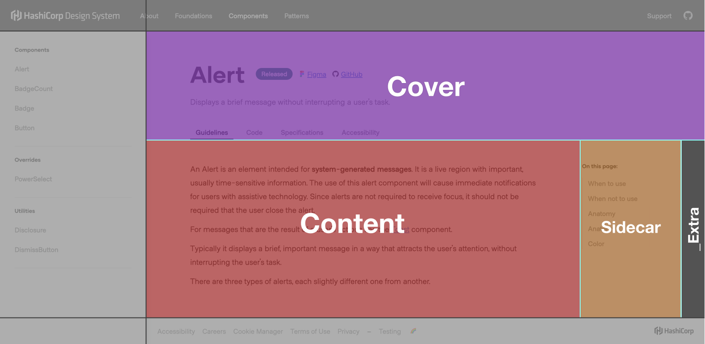
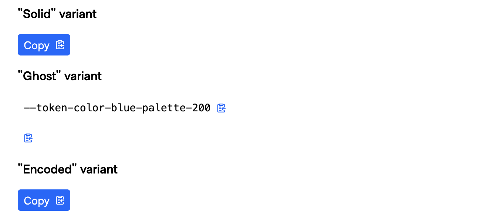
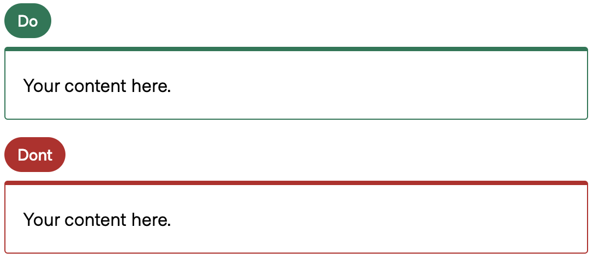

# Website / Doc styling and components

- [Website / Doc styling and components](#website--doc-styling-and-components)
  - [Styling](#styling)
    - [Typography](#typography)
      - [CSS helper classes](#css-helper-classes)
      - [Sass mixins](#sass-mixins)
    - [Colors](#colors)
    - [Breakpoints](#breakpoints)
    - [Grids (layout)](#grids-layout)
  - [Components](#components)
    - [Page-related components](#page-related-components)
    - [Documentation components](#documentation-components)
      - [Badge](#badge)
        - [Accessibility conformance rating badges](#accessibility-conformance-rating-badges)
      - [Banner](#banner)
        - [Recommended banner usage](#recommended-banner-usage)
      - [CopyButton](#copybutton)
      - [DoDont](#dodont)
      - [CodeBlock](#codeblock)
    - [Form components](#form-components)
      - [Label](#label)
      - [Search](#search)
      - [Select](#select)
    - [Other components](#other-components)

---

## Styling

### Typography

There are two ways to apply one of the pre-defined typographic styles (defined in Figma) to UI elements: one via CSS helper classes and one via Sass mixins. Depending on what you need to do, one or the other is preferable.

#### CSS helper classes

You should use CSS helper classes names whenever you need to apply typographic styles to generic textual content (see for example the pages under the "About" section, that are built using Handlebars markup).

Notice: these CSS classes **add vertical spacing** (`margin-top/bottom`) to the elements they're applied to.

You can see the list of available CSS helper class names that you can use here: [website/app/styles/typography/helpers.scss](https://github.com/hashicorp/design-system/blob/main/website/app/styles/typography/helpers.scss).

#### Sass mixins

You should use Sass mixins whenever you need to apply typographic styles to custom elements or component elements (see for example the `Doc` components that contain textual elements).

A low-level set of Sass mixins is also available,

Notice: these Sass mixins **don't add vertical spacing** (it's left to you, because it depends on the context where they're used), just the font style (`font-family/size/weight + line-height`).

You can see the list of available Sass mixins that you can use  here: [website/app/styles/typography/mixins.scss](https://github.com/hashicorp/design-system/blob/main/website/app/styles/typography/mixins.scss) (it includes some extra "supporting styles" for navigation and labels).

### Colors

We have a predefined list of CSS variables that can be used whenever you need to declare a standard color in CSS.

You can find the list of available color tokens here: https://github.com/hashicorp/design-system/blob/main/website/app/styles/tokens.scss

### Breakpoints

We have defined a set of breakpoints for each media query needed for the application (and created Sass mixins for them).

You can find the list of available breakpoints and associated media-query mixins here: [website/app/styles/breakpoints/index.scss](https://github.com/hashicorp/design-system/blob/main/website/app/styles/breakpoints/index.scss).


### Grids (layout)

To organize the page content in a responsive layout, we have relied on nested CSS grids.

Below you can find an overview of the overall page structure.

The "root" grid is defined in [the "page wrapper" element](https://github.com/hashicorp/design-system/blob/wiki/website/app/styles/pages/application/index.scss#L31-L39):



Inside the "stage" main area, we have another grid that is responsible for organizing the "page" content:



For more details on how these CSS grids have been implemented and how they work at different viewports  –there's plenty of media queries! 🙂 – you have to refer to the actual source code: https://github.com/hashicorp/design-system/tree/wiki/website/app/styles/pages/application

## Components

### Page-related components

There are different page-related components that are used for the layout and presentation of the content.

Here's a list, for general knowledge:

- `Doc::Header` - The page header used for navigation across top-level categories
  - `Doc::Header::nav-item` - The navigational item inside the header
- `Doc::Sidebar` - The left sidebar of the page used for navigation across pages
- `Doc::Stage` - The main "stage" area of the page
  - `Doc::Cover` - The "cover" block that contains the main title of the page
  - `Doc::Content` - The main "content" area
  - `Doc::Sidecar` - The "sidecar" used for in-page navigation
- `Doc::Footer` - The bottom page footer

Since these are infrastructural elements of the pages, we don't expect them to be used extensively in the future for contend editing.

In case you need to use (or modify) these components and you're not sure how to do it, speak with the engineers of the HDS team and they can help.
You can also look at the underlying code if you want to understand how they work:
- https://github.com/hashicorp/design-system/tree/main/website/app/components/doc/page
- https://github.com/hashicorp/design-system/tree/main/website/app/styles/pages

If you want to see these elements in action, have a look at the website itself https://hds-website-hashicorp.vercel.app/, inspect the pages using the Developer Tools in your browser, check how the CSS grids are used for laying out the components, try out their responsiveness at different viewports, etc.


### Documentation components

#### Badge

The `Doc::Badge` component is used to show a textual "badge" with different visual "states".

It provides the following API:
- `@type` - the type of banner - possible values: `neutral` (default), `information`, `success`, `warning`, `critical`, `outlined`
- `yield` - the content passed to the component is yielded

An invocation of the badge looks like this:

```
<Doc::Badge @type="success">Hello!</Doc::Badge>
```

You can see a showcase of different variants for this component here: https://hds-website-hashicorp.vercel.app/testing/components/badge/


##### Accessibility conformance rating badges
Badges are used to show the conformance rating in the accessibility section of our component documentation. There are 3 conformance ratings: `Conformant`, `Conditionally Conformant`, and `Not Conformant`. Most of our components are `Conformant` or `Conditionally Conformant`.

⚠️ **Important:** If finding that you need to use `Not Conformant`, reach out to the design systems team to confirm you have the proper status.


#### Banner

The `Doc::Banner` component is used to highlight a certain piece of content in a page. It should be used **preferably** via [markdown custom syntax](./Website-Markdown.md#banner) or it could be used directly as an Ember component, but **only if necessary** (for example in Handlebar template files).

You can see a showcase of different variants for this component here: https://hds-website-hashicorp.vercel.app/testing/components/banner/


##### Recommended banner usage
- `Information`: Use for informational content and tips.
  - Consider if the content in an information banner really needs to have prominence on the page.
- `Warning`: Use for important messages cautioning consumers about a topic or to communicate breaking changes.
- `Critical`: Use for sunset notices and deprecation messaging.
- `Insight`: Use for migration tips from Structure.

#### CopyButton

The `Doc::CopyButton` component is a small component used to show small code snippets and optionally allow the user to copy them in memory.

It provides the following API:
- `@type` - determines the style of the button - possible values: `solid` (default) or `ghost`
- `@textToCopy` - the text that the user will copy when they click the button (may be different from what is shown, if needed)
- `@textToShow` - the text that the user will see (when the button is `ghost`) - if not provided, the component will use the value of `@textToCopy`
- `@encoded` - if the text to copy is encoded (to avoid issues with the rendering inside Handlebars / Ember components) - default to `false`

An invocation of the copy button looks like this:

```
<Doc::CopyButton @textToCopy="Yay!" @type="solid" />
<Doc::CopyButton @textToCopy="With this we can show different text from what is actually copied ;)" @textToShow="--token-color-blue-palette-200" @type="ghost" />
```

You can see a showcase of different variants for this component here: https://hds-website-hashicorp.vercel.app/testing/components/copy-button/



#### DoDont

The `Doc::DoDont` component is used to highlight a certain piece of content in a page as something to "Do" or "Don't". It should be used **preferably** via [markdown custom syntax](./Website-Markdown.md#dodont) or it could be used directly as an Ember component, but **only if necessary** (for example in Handlebar template files).

You can see a showcase of different variants for this component here: https://hds-website-hashicorp.vercel.app/testing/components/do-dont/



#### CodeBlock

There is no `Doc::CodeBlock` component as a standard Ember component.

The code block used to show a snippet of code (and optionally render/preview it in the browser) is done simply using "fenced code blocks" declarations in markdown.

For details about how to use these code blocks and the syntax used to declare them refer to the [documentation on code blocks in markdown](./Website-Markdown.md#code-block)

### Form components

#### Label

The `Doc::Form::Label` is a `<label>` element used in the form controls, with a pre-defined styling.

It provides the following API:
- `@for` - the `for` attribute
- `@label` - the textual content on the `<label>` element

#### Search

The `Doc::Form::Search` is an `<input type="search">` control that can be used within forms of filters.

It provides the following API:
- `@label` - the textual content of the `<label>` associated to the `<input>` control (the `@for` value is automatically generated)
- `@placeholder` - the "placeholder" text of the `<input>` control
- `@searchQuery` - the "value" text of the `<input>` control
- `onInput` - the callback executed on the `input` event of the control

#### Select

The `Doc::Form::Select` is a `<select>` element that can be used within forms of filters.

It provides the following API:
- `@label` - the textual content of the `<label>` associated to the `<input>` control (the `@for` value is automatically generated)
- `@selectedValue` - the currently selected value for the control
- `onSelect` - the callback executed on the `change` event of the control

🚧 The component at the moment has a predefined list of values, needs to be refactored and generalized.

If you want to see these elements in action:
- https://hds-website-hashicorp.vercel.app/foundations/icons?tab=library/

If you want to see the underlying code and use it as reference/inspiration:
- 🚧 link to the forms components when PR https://github.com/hashicorp/design-system/pull/885/ is merged
- https://github.com/hashicorp/design-system/blob/main/website/app/components/doc/icons-list/index.hbs


### Other components

There are also other components, used only in very specific contexts or pages. We can't list them all, so look inside the [`website/app/components/doc`](https://github.com/hashicorp/design-system/tree/main/website/app/components/doc/) folder for more details about their code implementation and their APIs, and search in the actual code of the documentation pages for how they are used.
