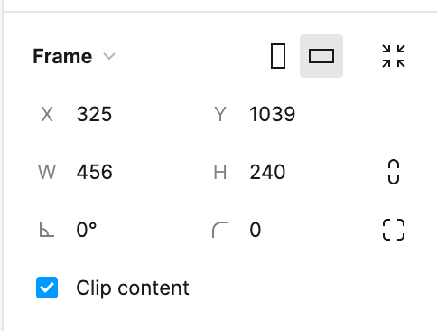
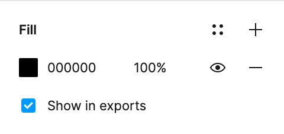

# Website / Media

- [Website / Media](#website--media)
  - [Where to store the media files](#where-to-store-the-media-files)
  - [Where to find the source for the media files](#where-to-find-the-source-for-the-media-files)
  - [How to export the files](#how-to-export-the-files)

---

## Where to store the media files

At the time of writing, the only way for a markdown file to "consume" an image (or media file in general) is if the image is stored in the `website/public` folder, which is cloned at build time into the `dist` folder. It's not super ergonomic, and we're considering the possibility to change our build pipeline so that relative paths to images are allowed (and work as expected), but at the moment is still considered a non-blocking improvement.

## Where to find the source for the media files

All the assets used in the website are collected under [the Figma file "Website assets"](https://www.figma.com/file/42LK10XbP5IERhzzgMOiI2/Website-assets?node-id=0%3A1&t=xf7eqxGJEBopQM5d-0).

Please add the original source of every image or illustration that you add to the documentation, so that it's easy to find and change if necessary.

## How to export the files

As mentioned above, the generated files should be exported in the `website/public` folder.

Regarding the format and settings of the "Export" panel in Figma, please follow these guidelines:

- assets should be ready to be exported as they are, without the need for someone to do something
  - give them frame the exact name that will be used in the code
    - no uppercase, no space, no slash, no special characters (eg. `this-is-my-file`)
    - choose how the asset should be exported: the resolution (generally will be `@2x`) and the format (`SVG`, `PNG`, `JPG`, depending on the context)
      - consider the content of the image
        - it’s just vectors, with normal paths? probably an `SVG` is best
        - it’s vectors, but with thousands of points? export in `SVG` and `PNG` and compare the size, then choose
        - it’s both vectors and bitmap (eg. the new illustrations)? then `JPG` is the one that compress better
  - decide if the frame should be clipped or not (generally is not necessary if it’s `SVG`, but if it’s `JPG` is better because in some cases it may create visual artifacts on the borders)
    - 
  - decide if the background color applied to the frame should be exported or not (if it’s `SVG` almost certainly not, if it’s `PNG` or `JPG` almost certainly yes)
    - 
- consider the frame size in relation to what is the real use case
  - is it a fixed size in the page? use the exact same size (and export at `@2x`)
  - is it an image that resizes when the viewport changes? speak with the developer and decide what is the right size to use

If you have any doubts or problems exporting the files, speak with one of the designers of the HDS team.
